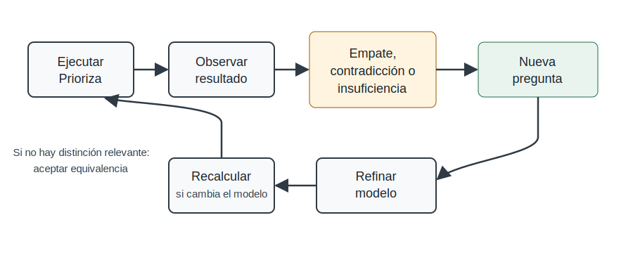

# Formas generales de uso de Prioriza

Las formas de uso describen patrones abstractos de aplicación del
método, independientes de un dominio específico. No son aplicaciones
concretas como timetabling, Odoo, gestión de tickets o selección de
proveedores. Son maneras generales de operar con tablas Prioriza y con
sus resultados.

Esta sección organiza esas formas de uso para evitar confundir el núcleo
del método con sus aplicaciones específicas.

## Ejecución simple

La ejecución simple es la forma básica de uso.

    una tabla -> un conjunto de elementos -> un resultado de prioridad

En esta forma, se define una tabla Prioriza, se cargan los valores de
los elementos, se nivelan los aspectos, se aplican niveles de prioridad de los aspectos y se obtiene
una estructura de prioridad.

Es la forma más directa y corresponde al uso elemental del método.

### Reutilización

La reutilización consiste en ejecutar la misma plantilla de decisión más
de una vez, con elementos que pueden cambiar entre ejecuciones.

    tabla T + elementos E1 -> resultado R1
    tabla T + elementos E2 -> resultado R2
    tabla T + elementos E3 -> resultado R3

La estructura de la tabla se conserva; los elementos y valores pueden
cambiar.

Esta forma de uso permite convertir decisiones recurrentes en procesos
explícitos, comparables y versionables.

## Uso del resultado como dato derivado

El resultado de una ejecución Prioriza puede usarse como dato derivado
en otra operación.

El resultado puede tomar varias formas:

- columna de niveles finales;
- ranking de elementos;
- grupos de prioridad;
- lista de empates;
- nivel de prioridad del aspecto derivado;
- valor derivado;
- referencia para ingeniería inversa.

Esto significa que una ejecución de Prioriza no termina necesariamente
en una acción inmediata. Puede producir información intermedia para otra
decisión.

## Composición de tablas

La composición ocurre cuando una tabla utiliza el resultado de otra
tabla.

    Tabla X -> resultado RX
    Tabla Y usa RX -> resultado RY

La composición es un concepto más general que la recursividad. Una
composición puede ser simple, lineal y finita sin que exista una
estructura recursiva compleja.

Ejemplos de composición:

- usar el resultado de una tabla como valor de un aspecto en otra tabla;
- usar el resultado de una tabla para definir niveles de prioridad de los aspectos de aspectos;
- usar el resultado de una tabla como criterio auxiliar;
- usar el resultado de una tabla como referencia para comparar otra
  tabla.

## Recursividad acotada

La recursividad es una forma particular de composición donde Prioriza se
aplica nuevamente sobre resultados producidos por Prioriza.

    Prioriza -> resultado -> Prioriza -> resultado

Debe ser acotada, explícita y trazable. Debe terminar en valores base,
criterios base o decisiones explícitas.

La recursividad permite descomponer decisiones complejas sin construir
una única tabla enorme. También permite justificar niveles de prioridad de los aspectos, calcular
aspectos compuestos y abrir la estructura de la subjetividad.

## Ingeniería inversa

La ingeniería inversa parte de un resultado deseado, esperado o ya
observado, y pregunta qué valores, niveles, niveles de prioridad de
aspectos, criterios o aspectos harían posible ese resultado.

    resultado deseado -> condiciones necesarias -> ajuste o diagnóstico del modelo

Puede usarse para explicar contradicciones, analizar sensibilidad,
detectar aspectos faltantes, justificar niveles de prioridad de los aspectos o auditar decisiones.

La ingeniería inversa no debe usarse para manipular resultados sin
justificación. Todo cambio derivado de ella debe quedar documentado.

## Uso iterativo con recálculo

El uso iterativo con recálculo ocurre cuando Prioriza se ejecuta dentro
de un proceso donde el contexto cambia después de cada acción.

La forma abstracta es:

    1. Evaluar el contexto actual.
    2. Ejecutar Prioriza.
    3. Tomar una acción basada en la prioridad obtenida.
    4. Actualizar el contexto.
    5. Recalcular Prioriza.
    6. Repetir mientras existan elementos por decidir.

Esta forma de uso no pertenece exclusivamente a la asignación de
recursos ni al timetabling. Puede aparecer en cualquier proceso donde
cada decisión modifica las condiciones de las decisiones siguientes.

En este patrón, el primer resultado no se usa hasta el final sin
cambios. Se recalcula porque el contexto ya no es el mismo.

## Uso del resultado como nivelación de otra columna

Una forma importante de composición consiste en usar el resultado final
de una tabla como nivel o valor de una columna en otra tabla.

Ejemplo abstracto:

    Tabla X evalúa los elementos bajo un grupo de aspectos AX.
    Produce una columna RX de niveles finales.
    Tabla Y usa RX como una columna adicional o como valor derivado.

Esto permite que una decisión parcial se convierta en un aspecto dentro
de una decisión más amplia.

## Uso del resultado como nivel de prioridad de aspectos

Otra forma de composición ocurre cuando una tabla Prioriza se usa para
priorizar los propios aspectos de otra tabla.

    Tabla X prioriza aspectos.
    Resultado RX = niveles de prioridad de los aspectos derivados.
    Tabla Y usa RX como vector de niveles de prioridad de los aspectos.

Esto permite justificar niveles de prioridad de los aspectos que, de otro modo, serían asignados
directamente por intuición o autoridad.

## Acoplamiento entre tablas con los mismos elementos

Puede ocurrir que dos tablas compartan los mismos elementos, pero usen
conjuntos distintos de aspectos.

    Tabla X:
    Elementos = E
    Aspectos = AX
    Resultado = RX

    Tabla Y:
    Elementos = E
    Aspectos = AY
    Resultado = RY

Esta situación permite comparar cómo se ordenan los mismos elementos
bajo diferentes particiones de aspectos.

Preguntas posibles:

    ¿Los elementos tienen la misma prioridad bajo AX y bajo AY?
    ¿Qué aspectos explican la diferencia entre RX y RY?
    ¿Qué tendría que cambiar en AY para reproducir RX?
    ¿Qué revela la diferencia entre ambas tablas?

Esta forma de uso es útil para análisis, comparación e ingeniería
inversa.

## Proyección inversa entre tablas

La proyección inversa entre tablas ocurre cuando el resultado de una
tabla se usa como resultado objetivo para analizar otra tabla con los
mismos elementos, pero con otros aspectos.

Ejemplo:

    Tabla X produce RX.
    Tabla Y tiene los mismos elementos, pero otros aspectos.
    Pregunta: ¿qué valores, niveles locales, niveles de prioridad de aspectos o criterios en Y producirían un resultado compatible con RX?

Esto permite estudiar relaciones entre grupos de aspectos.

No se trata de rotar literalmente una tabla. La idea de rotación es una
metáfora de razonamiento: una columna final puede funcionar como
referencia para mirar otra tabla desde otro ángulo.

## Comparación de ejecuciones

Dos ejecuciones de Prioriza pueden compararse entre sí.

Comparar ejecuciones permite responder:

- qué cambió entre una ejecución y otra;
- qué elementos subieron o bajaron de prioridad;
- qué aspectos explican el cambio;
- si el cambio se debe a valores, niveles de prioridad de aspectos,
  criterios o elementos nuevos;
- si una tabla nueva produce resultados más coherentes que una tabla
  anterior.

Esta comparación es clave cuando Prioriza se usa en contextos
versionados o recurrentes.

## Formas de uso y software

Para soportar estas formas de uso, una implementación de Prioriza
debería tratar el resultado como un objeto reutilizable, no como un
simple número.

Un resultado debe poder:

- guardarse;
- versionarse;
- compararse;
- usarse como entrada de otra tabla;
- usarse como niveles de prioridad de los aspectos;
- usarse como columna derivada;
- usarse como objetivo de ingeniería inversa;
- explicarse.

Esto prepara el camino para una especificación técnica posterior.

Esta capacidad de generar preguntas es parte del valor diagnóstico del
método. Prioriza no solo ordena alternativas; ayuda a descubrir la
estructura real de la decisión.

El resultado de Prioriza puede ser una respuesta, pero también puede ser
una pregunta. Un empate pregunta qué aspecto falta. Una contradicción
pregunta qué valor o prioridad no coincide con el sistema declarado. Un
resultado contraintuitivo pregunta si la intuición contiene información
no modelada o si la intuición está sesgada.

## Uso del resultado como generador de preguntas

Este patrón modela una forma común de razonamiento humano. Una persona
empieza con un criterio, descubre que no basta, agrega otro, ajusta
prioridades, vuelve a comparar y finalmente decide o acepta la
indiferencia. Prioriza hace ese proceso explícito y computable.

Una forma general de uso consiste en ejecutar Prioriza no para cerrar
inmediatamente la decisión, sino para revelar qué falta para decidir
mejor. El ciclo es: ejecutar, observar resultado, detectar empate,
contradicción o insuficiencia, formular una nueva pregunta, ajustar la
tabla y ejecutar nuevamente.

## Ciclo de refinamiento progresivo

El refinamiento progresivo de la decisión es una forma general de uso de
Prioriza. No parte de la idea de que la primera tabla deba resolverlo
todo. Parte de una idea más prudente: una ejecución puede mostrar que el
modelo ya es suficiente, que falta información, que existe una
contradicción o que hay equivalencia legítima entre alternativas.

El ciclo operativo puede describirse así:

```text
ejecutar Prioriza
observar el resultado
si el ganador es aceptable: decidir
si hay empate: preguntar qué aspecto podría distinguir alternativas
si hay contradicción: revisar valores, criterios o niveles de prioridad
si no queda distinción relevante: aceptar la equivalencia o usar un
desempate externo
recalcular cuando cambie el modelo
```

{#fig-refinamiento}

Como muestra @fig-refinamiento, el resultado puede cerrar una decisión o
abrir la siguiente pregunta útil para mejorar el modelo.

La diferencia entre insuficiencia del modelo y empate legítimo es
central. Hay insuficiencia cuando las alternativas aparecen iguales
porque faltan aspectos, valores, reglas o información relevante. Hay
empate legítimo cuando el modelo ya contiene los aspectos relevantes y,
aun así, las alternativas son equivalentes bajo la estructura de
prioridad declarada. En el primer caso, Prioriza produce una pregunta
para mejorar el modelo. En el segundo, produce una decisión no única que
puede aceptarse.

Esta forma de uso evita dos errores opuestos: forzar una diferencia que
el modelo no puede justificar, o abandonar el método cada vez que no
produce un ganador inmediato. Un buen resultado puede ser una nueva
pregunta: ¿qué aspecto falta?, ¿qué valor es dudoso?, ¿qué prioridad de
aspecto contradice la política real?, ¿la intuición aporta conocimiento
no modelado o solo presión operativa?

## Resumen de la sección

Prioriza no solo se usa ejecutando una tabla una vez. También puede
reutilizarse, componerse, invertirse, recalcularse iterativamente,
acoplarse con otras tablas y proyectar resultados entre estructuras de
decisión.

Estas formas de uso no son aplicaciones específicas. Son patrones
generales de operación del método.
