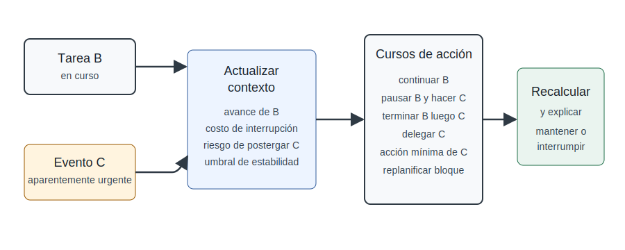

# Aplicaciones dinámicas y asignación de recursos

Esta sección abstrae una forma de uso que apareció históricamente en
Áncora GOH, pero que no pertenece únicamente al dominio de horarios. La
idea general es aplicar Prioriza dentro de procesos donde cada decisión
modifica el contexto de las decisiones siguientes.

En una aplicación dinámica, Prioriza no se ejecuta una sola vez para
producir una lista fija. Se ejecuta, se toma una acción, el contexto
cambia, y entonces se ejecuta nuevamente. La prioridad es dependiente
del contexto actual.

## Patrón general de aplicación dinámica

El patrón abstracto puede describirse así:

1\. Identificar el contexto actual.\
2. Identificar los elementos pendientes o acciones candidatas.\
3. Medir o estimar valores para cada elemento.\
4. Ejecutar Prioriza.\
5. Seleccionar el elemento o grupo prioritario.\
6. Ejecutar una acción propia del dominio.\
7. Actualizar el contexto.\
8. Repetir mientras exista necesidad de decisión.

Este patrón puede aplicarse en horarios, asignación de recursos,
planificación semanal, priorización de tickets, gestión de riesgos,
asignación de equipos o agentes de inteligencia artificial que deben
elegir su próxima acción.

## Diferencia entre aplicación estática y dinámica

| **Tipo de uso** | **Descripción** | **Ejemplo** |
|:---|:---|:---|
| Estático | Se ejecuta una tabla sobre un conjunto de alternativas y se obtiene una prioridad para ese contexto. | Seleccionar un proveedor entre tres opciones. |
| Recurrente | Se reutiliza la misma tabla en distintos momentos, pero cada ejecución puede analizarse de forma independiente. | Priorizar tareas cada lunes. |
| Dinámico | Cada decisión modifica el contexto y exige recalcular antes de la siguiente decisión. | Construir un horario, asignando una actividad y recalculando las restantes. |

## Asignación de recursos como dominio de aplicación

La asignación de recursos es una aplicación natural de Prioriza porque
suele contener elementos en competencia por recursos limitados. Los
recursos pueden ser tiempo, dinero, personas, máquinas, aulas,
servidores, vehículos, presupuestos, turnos o atención ejecutiva.

En este dominio, Prioriza puede ayudar a decidir qué elemento debe
recibir atención primero. Sin embargo, debe distinguirse entre priorizar
y asignar. Prioriza produce una estructura de prioridad; la asignación
concreta puede requerir reglas adicionales del dominio.

Prioriza responde: ¿qué elemento atiendo primero?\
El algoritmo de dominio responde: ¿qué recurso concreto le asigno y
cómo?

## Preservación de posibilidades futuras

En aplicaciones dinámicas, una decisión local puede afectar la
viabilidad de decisiones futuras. Por eso no basta con seleccionar el
elemento prioritario. También debe evaluarse, cuando corresponda, qué
solución concreta preserva mejor las posibilidades de los demás
elementos.

Este principio puede formularse así: no consumir una solución que otro
elemento necesita críticamente si existe una solución equivalente para
el elemento actual. En horarios, esto se expresa como no ocupar el único
turno viable de otra actividad si la actividad actual puede colocarse en
otro turno equivalente. En otros dominios, puede significar no asignar
un recurso escaso a una tarea que podría resolverse con un recurso más
común.

## Inserción, movimiento y reparación

El patrón dinámico permite tratar no solo construcción desde cero, sino
también inserción, movimiento y reparación. Si existe un contexto ya
construido, una nueva acción puede requerir recalcular prioridades
dentro de ese contexto.

- Insertar un elemento nuevo en una estructura existente.

- Mover un elemento de una posición a otra.

- Reparar una inconsistencia o conflicto.

- Reasignar recursos cuando cambia la disponibilidad.

- Recalcular prioridades después de una emergencia o restricción nueva.

Desde el punto de vista abstracto, todas estas operaciones comparten la
misma forma: contexto actual, alternativas posibles, priorización,
acción, contexto actualizado.

## Relación con heurísticas constructivas

En problemas de construcción de soluciones, Prioriza puede actuar como
política de selección. No explora necesariamente todo el espacio de
soluciones; ayuda a elegir el próximo elemento a tratar según criterios
explícitos.

Esto lo acerca a heurísticas constructivas y reglas de despacho. Su
diferencia práctica es que la regla de despacho no queda reducida a un
solo criterio, sino que puede construirse como una tabla multicriterio,
con niveles, niveles de prioridad de los aspectos y explicación.

## Riesgos de uso dinámico

- Recalcular demasiado puede ser costoso si los valores son difíciles de
  obtener.

- Recalcular muy poco puede dejar decisiones desactualizadas.

- Una mala función de nivelación puede amplificar errores en cada
  iteración.

- Un criterio local puede producir decisiones miopes si no se modela
  impacto futuro.

- Las restricciones duras deben filtrarse antes de la priorización, no
  compensarse mediante niveles de prioridad de los aspectos.

## Resumen de la sección

La aplicación dinámica de Prioriza consiste en ejecutar el método dentro
de un proceso donde cada acción modifica el contexto. Esta forma de uso
es especialmente útil en asignación de recursos y construcción gradual
de soluciones. Debe presentarse como una aplicación operacional del
método, no como su definición esencial.

## Replanificación priorizada por evento

Una aplicación dinámica de Prioriza debe contemplar eventos nuevos que
interrumpen la planificación. Por ejemplo, un empleado está ejecutando
la tarea B porque Prioriza la indicó después de A, pero aparece una
tarea C aparentemente urgente. En ese caso, la pregunta correcta no es
simplemente si C es urgente, sino si debe interrumpirse B para atender
C.

La nueva tarea o evento debe entrar, salvo emergencia absoluta, en el
mismo proceso de priorización. Si el edificio está en llamas, no hay
decisión multicriterio que discutir. Pero si se trata de una urgencia
operacional, debe compararse con el contexto actual.

En estos casos, los elementos no tienen que ser solamente tareas. Pueden
ser cursos de acción: continuar B, pausar B y hacer C, terminar B
primero y luego C, delegar C, dividir C en una acción mínima o
replanificar el bloque completo.

Esto separa prioridad de tarea y prioridad de acción. La tarea C puede
ser importante o urgente, pero la decisión concreta puede ser no hacer C
completa inmediatamente, sino delegarla, ejecutar una acción mínima,
esperar a terminar B o replanificar el bloque. Prioriza debe comparar
acciones posibles dentro del contexto actualizado, no solo insertar una
nueva tarea en la lista.

{#fig-replanificacion-evento}

@fig-replanificacion-evento muestra que la urgencia aparente se evalúa
junto con el estado actual, el costo de interrupción y los cursos de
acción disponibles.

Para decidir correctamente, Prioriza debe incorporar información sobre
la tarea en curso y sobre el costo de interrupción: avance actual de B,
tiempo restante, costo de cambio de contexto, riesgo de dejar B
incompleta, impacto de posponer C, compromisos asociados y posibilidad
de delegación.

Esto introduce una regla de estabilidad de planificación. No toda
diferencia mínima de prioridad debe romper el plan. Puede exigirse un
umbral de interrupción: C solo desplaza a B si su prioridad supera a B
con suficiente margen o si activa una restricción dura definida por la
organización.

La explicación humana es esencial: “C desplaza a B porque tiene
vencimiento inmediato, afecta a un cliente crítico y el costo de
interrumpir B es bajo”, o “C no desplaza a B porque B está cerca de
terminarse, bloquea otras tareas y suspenderla tendría alto costo de
recuperación”.

La advertencia metodológica es importante: Prioriza no debe convertir al
sistema en reactivo ante toda urgencia aparente. La planificación tiene
valor propio. Romperla solo se justifica cuando el evento nuevo supera el
umbral de interrupción, activa una restricción dura o cambia de manera
significativa el contexto de decisión.

## Resumen ampliado de uso dinámico

La reactividad no debe significar improvisación. Prioriza puede
reaccionar ante eventos nuevos agregando alternativas o cursos de
acción, recalculando el contexto y justificando si se mantiene o se
rompe la planificación. Así, el método protege contra dos extremos:
rigidez ciega frente a cambios reales y volatilidad constante ante
urgencias aparentes.
